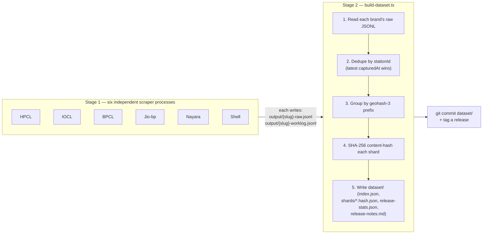

# Architecture

This document covers the scraper pipeline's own design — the parts that would
work identically no matter what schedules or hosts them. For how this
project specifically runs it on GitHub Actions today (the cron schedule,
caching, failure notifications), see [CI-CD.md](./CI-CD.md) instead — that's
a deliberately separate concern from what's described here.

## Pipeline

Conceptually, a full run is just two stages: six independent scraper
processes (one per brand, safe to run in any order or in parallel), followed
by one merge-and-publish step once they're done.



There is no separate publish/CDN step — the git commit above is the distribution.
Consumers fetch the committed files directly (`raw.githubusercontent.com` or a
clone); see the main [README](../README.md#quick-start).

---

## Components

### Provider interface (`src/provider.ts`)

The plug-in contract every brand implements. Three methods, two required:

- **`discover(opts)`** (required) — enumerates all units of work as an
  `AsyncIterable<WorkUnit>`, where `WorkUnit = { id: string; payload: unknown }`.
  `id` is the resumability key and must be stable + collision-free across a
  provider's entire discovery stream. `discover()` deliberately does **not**
  receive `ctx` — any network call it needs runs on its own injectable
  `fetchImpl`, not `ctx.fetch`, since `ctx` doesn't exist yet at discovery time.
- **`process(unit, ctx)`** (required) — fetches/parses ONE work unit, returns a
  `ProcessResult`: `{ status, records: RawOutletRecord[], followups?, saturated? }`.
  `status` is one of `ok | empty | httpFailed | parsedNull | errored` — the exact
  same enum as `WorkLogRecord["status"]`. `ctx.fetch` and `ctx.now()` are both
  injectable, so tests never make a real network call or depend on wall-clock time.
- **`init?(ctx)`** (optional) — one-time setup before discovery/processing starts.
  BPCL uses it to fetch an initial OAuth token; Nayara uses it to bootstrap
  session cookies + a CSRF token from one GET of the locator page. Both exist so
  a broken auth setup fails fast, before any crawl work is attempted, rather than
  failing on every individual unit. HPCL, IOCL, Jio-bp, and Shell need no auth
  and skip this.

Discovery strategy per brand, briefly (see each brand's own doc for the full
API reference where one exists):

| Brand | Discovery | Auth |
|---|---|---|
| HPCL | Sitemap walk (`petrolpump.hpretail.in/sitemap.xml`) → per-district `.xml.gz` files → per-outlet `/Home` URLs | None |
| IOCL | Same "singleinterface.com" platform as HPCL, same shape (`locator.iocl.com/sitemap.xml`) | None |
| BPCL | Hand-curated route mesh (city-pair corridors) **+** an adaptive point-grid over India with saturation-triggered subdivision (see [EDGE-CASES.md](./EDGE-CASES.md)) | OAuth token, fetched in `init()` |
| Jio-bp | One `FetchROMaster` call for the national station index, then batches of station codes (default 18/batch) as work units | None — identity fields are unvalidated constants (see [jiobp-api.md](./jiobp-api.md)) |
| Nayara | Two large-radius (`3000km`) `/get-code-ro-radius` calls from widely separated center points — each alone returns close to the entire national roster (see [nayara-api.md](./nayara-api.md)) | Session cookies + CSRF token, bootstrapped in `init()`, refreshed on HTTP 419 |
| Shell | Recursive bounding-box walk over India via `within_bounds` (subdivides when the response signals `clusters`), then one `GET /api/v2/locations/{id}` per outlet id (see [shell-api.md](./shell-api.md)) | None |

All brand-specific knowledge lives in the provider; the runner is fully generic.

### runProvider (`src/run-provider.ts`)

This is the piece worth understanding in depth, since it's what makes the
whole pipeline resumable and safe to interrupt — a plain, boring design, on
purpose.

**The core idea:** every attempt to fetch one outlet gets appended as one
line to a log file — never overwritten, only ever added to. That line just
says which outlet, whether it worked, and when. Before starting any new
work, a run reads that log and asks, for every outlet it knows about: "does
the most recent line for this outlet say it succeeded, and was that recent
enough?" If yes, skip it — zero requests made. If no — never attempted,
previously failed, or just stale — it goes in this run's queue.

The one rule that makes this safe rather than merely fast: **a failure is
never allowed to count as "done."** No matter how many times an outlet fails,
or how recently, it stays in the queue and gets retried on every future run
until it actually succeeds (or is confirmed to legitimately have nothing —
which counts the same as succeeding). This is a deliberate asymmetry: a
success can retire a unit of work, but nothing except a success can. That
one rule is what guarantees a transient failure can never quietly turn into
a permanent gap in the data — there's no code path where "this failed" ever
gets treated the same as "this is done."

On top of that, before writing anything new, a run also reloads whatever was
already published, collapses down to one record per outlet (favoring
whichever capture is more recent), and drops anything that hasn't had a
successful capture in a while (on the theory that a station nobody's been
able to confirm for two weeks has probably closed or moved). Everything
freshly scraped this run gets added on top of that survivors list. So what
gets published is always "everything still recently confirmed to exist,"
continuously topped up — never something that resets to empty and rebuilds
from scratch, even if a run gets cut off halfway through.

Put together, those two ideas — append-only log of attempts, with only
success ever marked as done, layered under a baseline that only ever
accumulates and prunes rather than resets — are what let this whole pipeline
be interrupted at any point, on any schedule, run by anyone, without ever
needing a human to notice and manually patch up a gap.

The actual orchestration steps, mechanically:

1. Calls `provider.init()` if present.
2. Calls `provider.discover()` and collects every work unit.
3. Loads the existing worklog (`{slug}-worklog.jsonl`) and computes the
   already-done set via `computeDoneWorkUnitIds` — a unit counts as done only
   if its **latest** record has `status` `"ok"` or `"empty"` **and** was fetched
   within `maxAgeDays` (default 3). Any other status is *never* treated as
   done, regardless of recency, so a transient failure always gets retried on
   the next run instead of becoming a silent permanent gap.
4. **Seeds the raw output from the committed baseline.** Before processing
   anything new, it reads the existing `{slug}-raw.jsonl(.gz)`, dedupes it by
   `stationId` (latest `capturedAt` wins), drops any record whose
   `capturedAt` is older than `staleAfterDays` (default 14 — a station that
   hasn't been re-captured in two weeks is treated as likely closed/moved and
   aged out), and rewrites `{slug}-raw.jsonl` with what's left. This is why a
   partial or interrupted run never collapses the published dataset back to
   whatever fraction it managed to scrape this run — the file always starts
   from everything still-fresh that was ever captured, and this run's results
   accumulate on top of that.
5. Drives a **dynamic queue** (`runDynamicQueue`) — `concurrency` lanes pull
   from the front of a shared, mutable queue array. A lane's `handle()` can
   push follow-up units onto the back of the same queue (BPCL's grid
   subdivision is the only current user of this). A lane only exits once the
   queue is empty **and** no lane is still mid-`handle()` — a momentarily
   empty queue doesn't mean done, since a sibling lane's in-flight call might
   be about to push more work.
6. Writes every processed unit's result through one serialized promise-chain
   writer (`createWriter`) shared across all lanes: `RawOutletRecord`s append
   to `{slug}-raw.jsonl`, worklog entries append to `{slug}-worklog.jsonl`, and
   a progress line (`{slug}-progress.txt`) is rewritten every `progressEvery`
   (default 25) processed units. Serializing through one writer is what
   guarantees concurrent lanes never interleave or corrupt either file.

A run is "finished" once every discovered unit is either already-done or
processed this run — `run-{brand}.ts` prints whether that happened and, if
not, how many units remain (safe to just re-run the same command; already-done
units are skipped).

### build-dataset (`src/build-dataset.ts`)

Reads all six brands' `output/{hpcl,iocl,bpcl,jiobp,nayara,shell}-raw.jsonl`
(preferring the `.gz` variant if present), deduplicates each brand
independently by `stationId` (latest `capturedAt` wins), merges across brands,
groups by 3-character geohash prefix, and writes:

- `dataset/shards/{prefix}.{sha256-hex-16}.json` — one file per cell, content-hashed
  so an unchanged cell keeps the same filename/URL across runs (old shard files
  are deleted and rewritten fresh every run, so a shard that moved geohash cells
  or emptied out doesn't linger).
- `dataset/index.json` — manifest: `schemaVersion`, `generatedAt`, `totalOutlets`,
  per-brand `brands` counts, and the `shards[]` array.
- `dataset/release-stats.json` — `{ previous, current }`, where `previous` is
  whatever `current` was in the release-stats.json this run overwrote — this is
  how the diff in release notes gets computed without needing separate state.
- `dataset/release-notes.md` — human-readable diff (or a baseline snapshot, on
  the very first publish) for the GitHub Release body.

A brand whose raw JSONL is missing/empty is tracked in `missingBrands` rather
than silently counted as zero — `release-notes.md` then shows "no data this
run" for that brand instead of a misleading "-23,980" drop. If every brand
produces zero outlets, `build-dataset` exits without touching `dataset/` at all
(a fully-failed run doesn't wipe the published dataset).

### Where this runs today

Everything above (`Provider`, `runProvider`, `build-dataset`) is plain
Node/TypeScript with no dependency on any particular scheduler or host — it
would behave identically run by hand, from a plain cron job on a server, or
from any CI system. This project happens to run it on GitHub Actions today;
the scheduling, the worklog caching between runs, the failure-notification
issue lifecycle, and the collapse-guard safety check are all specific to
*that* hosting choice and documented separately in
[CI-CD.md](./CI-CD.md) — deliberately kept out of this file so the two
concerns (what the pipeline does vs. where it happens to run) don't get
tangled together.

---

## Data flow

```
┌─────────────────────────────────────────────────────────────────┐
│  WorkUnit                                                        │
│  ────────                                                        │
│  { id: string, payload: unknown }                                │
│  Resumability key = id.                                          │
│  HPCL/IOCL:  id = sourceUrl of the per-outlet page                │
│  BPCL:       id = routeChunkId or cellId (grid cell)              │
│  Jio-bp:     id = "batch-{hash}" (a batch of station codes)       │
│  Nayara:     id = "center-{name}" (one of two fixed center points)│
│  Shell:      id = the outlet's geoapp.me location id               │
└─────────────────────────────────────────────────────────────────┘
         │ process()
         ▼
┌─────────────────────────────────────────────────────────────────┐
│  ProcessResult                                                   │
│  ─────────────                                                   │
│  { status, records: RawOutletRecord[], followups?, saturated? }  │
│  status = ok / empty / httpFailed / parsedNull / errored         │
│  ok/empty marks unit as "done" on resume                         │
│  followups = new WorkUnits (BPCL grid subdivision only)          │
└─────────────────────────────────────────────────────────────────┘
         │
         ├──→ output/{slug}-raw.jsonl      (RawOutletRecord[], append-only,
         │                                   seeded from the deduped, staleness-
         │                                   pruned baseline before this run's
         │                                   results are appended)
         └──→ output/{slug}-worklog.jsonl   (WorkLogRecord[], append-only)
                                                 │
                                                 │ runProvider filters done
                                                 │ units via computeDoneWorkUnitIds()
                                                 ▼
                                         resumability checkpoint
```

---

## Grade-agnostic boundary

This is the project's single most important design constraint. `RawOutletRecord`
has **no grade, no ethanol-content, no confidence, no E0/E10/E20/E85/E100
classification**. The `products` array captures every product+price the source
reports, exactly as written:

```ts
// RawProduct — nothing but name + price
{ name: "XP100", priceInr: 167.35 }
{ name: "Diesel", priceInr: 94.52 }
```

Why: deciding what counts as "ethanol-free" (or any other classification) is a
**subjective downstream opinion**, not a fact this dataset asserts. See
[docs/METHODOLOGY.md](./METHODOLOGY.md) for the full reasoning — this repo
never touches grade logic, and never will.

---

## Adding a new brand

1. Create `src/parsers/{brand}.ts` — parse the brand's outlet page or API
   response, return outlet metadata + products. Test against real,
   browser/proxy-captured fixtures — no live network calls in tests (every
   existing `src/parsers/*.test.ts` follows this pattern).
2. Create `src/providers/{brand}-provider.ts` — implement the `Provider`
   interface: `discover()` (how to find every outlet), `process()` (fetch one
   unit, call the parser, build a `RawOutletRecord` via
   `buildRawRecord`/`priceMapToProducts` from `lib/raw-record.ts`), and
   `init()` only if the brand needs auth.
3. Create `src/run-{brand}.ts` — a thin CLI entrypoint reading
   `{BRAND}_CENSUS_*` env vars and calling `runProvider(provider, opts)`.
4. Add a `census:{brand}` script to `package.json`.
5. Wire it into CI — see [CI-CD.md](./CI-CD.md) for how the six existing
   brand jobs are structured; a new brand follows the same shape.
6. Add the brand's slug to `build-dataset.ts`'s `BRANDS` array.

No changes needed to `types.ts`, `provider.ts`, `run-provider.ts`, or
`build-dataset.ts`'s dedup/merge logic — all of it is brand-agnostic by
design. Shell (`src/providers/shell-provider.ts`, a recursive bounding-box
walk against an unauthenticated JSON API) and Nayara (session+CSRF auth
against a WAF-protected endpoint) are the two most recently added brands and
the most representative worked examples to model a new one from — see
[shell-api.md](./shell-api.md) and [nayara-api.md](./nayara-api.md) for their
full API references.

---

## Technology

| Layer | Tool | Rationale |
|-------|------|-----------|
| Runtime | Node 22 + `tsx` (TypeScript runner) | No build step for scripts; widely available |
| HTTP | `fetch()` with exponential backoff (`src/http.ts`) | Zero dependencies, polite by default; also retries connection-level failures (DNS/TCP/TLS), not just 429/5xx |
| Parsing | `node-html-parser` for HTML; `JSON.parse` for API responses | Only production dependency |
| Testing | `vitest` | Fast, TS-native, watch mode |
| Sharding | Geohash (precision 3, ~156 km cells) via `src/geo.ts`'s `geohashEncode` | Map-friendly, deterministic, content-hashed |
| Compression | gzip (`gzip -f` in CI; `.jsonl.gz` files under GitHub's 50 MB limit) | Git-friendly, GitHub 50 MB limit compliant |
| Delivery | Direct from git (`raw.githubusercontent.com` or clone) | No separate publish step — the committed repo *is* the distribution |
| Orchestration | See [CI-CD.md](./CI-CD.md) | Decoupled from this doc — hosting-specific |

`src/geo.ts` also exports `neighborPrefixes`/`geohashDecodeBounds`/
`neighborCoverageKm` — bounding-box/neighbor-cell helpers for a spatial
*query* layer (a downstream consumer's map API). This repo's own pipeline
doesn't call them; only `geohashEncode` (sharding) and `haversineKm` (BPCL's
route-point interpolation) are actually used here.
