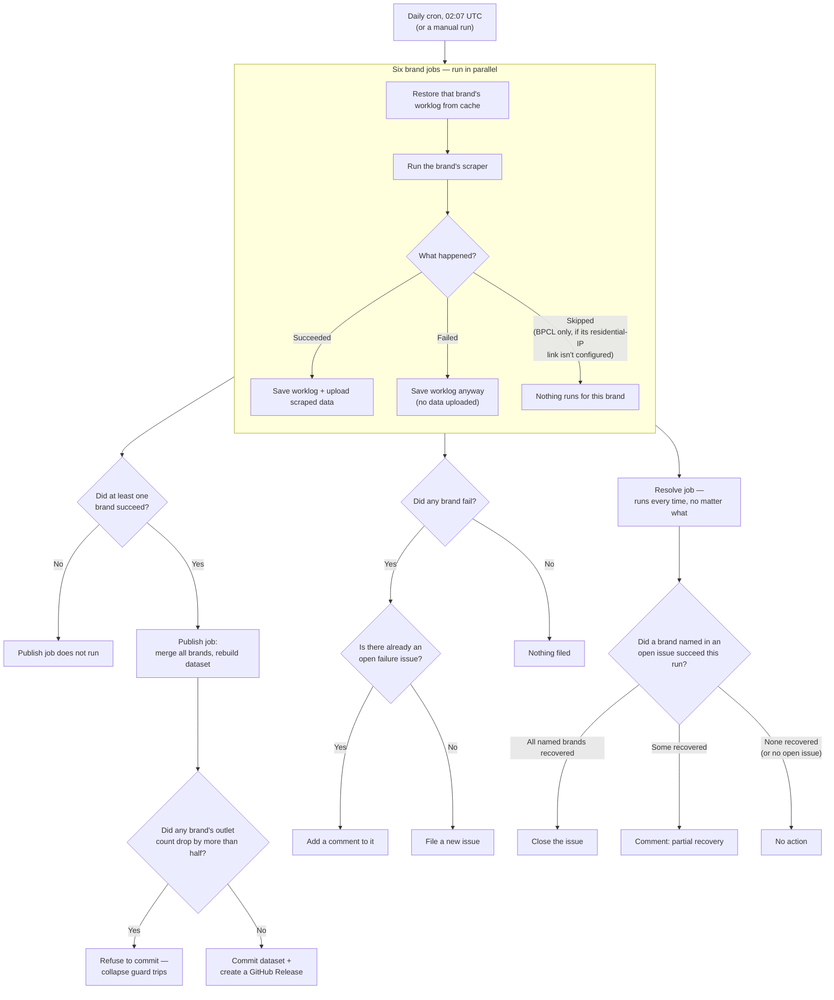

# CI/CD

This document is specifically about *how the scraper pipeline runs on GitHub
Actions* — the scheduling, the caching, the failure notifications. None of
this is about how the scraper code itself works (that's
[ARCHITECTURE.md](./ARCHITECTURE.md)); everything here is about the specific
hosting environment it happens to run in today. If this project ever moved
off GitHub Actions to some other scheduler, this whole document would need
rewriting — ARCHITECTURE.md wouldn't need to change at all. That's the split
this doc is deliberately making.

Everything below lives in one file: `.github/workflows/census.yml`.

---

## The whole thing, at a glance

Every box below is a real branch point in the workflow — this is every case
that can actually happen on a given day, not a simplified happy-path version.
The prose sections after this diagram walk through each part in more detail.

---

## The schedule

A cron trigger fires once a day, at 02:07 UTC. That's it — there's no other
automatic trigger. Someone can also start a run manually at any time (see
"Running it by hand" below).

---

## Why a cache is involved at all

Every time a GitHub Actions job runs, it starts on a **brand-new, disposable
virtual machine.** Nothing on that machine's disk is left over from the
previous run — it's wiped and rebuilt from scratch every single time. That's
fine for the actual scraped data, because that gets committed to git at the
end of a successful run and git *is* durable storage. But the scraper also
keeps a **worklog** — a running record of which outlets have already been
successfully checked recently, which is what lets a run skip work instead of
re-scraping the entire country every single day (see
[ARCHITECTURE.md](./ARCHITECTURE.md#runprovider-srcrun-providerts) for what
that file actually is and why). That worklog is *not* committed to git — it's
deliberately excluded, since it's disposable bookkeeping, not published data.

So there's a genuine problem: if the worklog only exists on a disk that gets
wiped after every run, every single day would start from a completely blank
worklog and re-scrape everything from zero, every day, forever. GitHub
Actions' **cache** feature exists exactly to solve this: it's a place to
stash a file at the end of one run and pull it back at the start of the next
one, even though the two runs happen on two completely unrelated virtual
machines.

## How the restore actually finds the right file

Each brand has its own cache slot. When a run starts, before scraping
anything, it asks the cache for a file under a key like
`worklog-hpcl-<this run's own unique ID>`. That exact key can **never**
match anything — it's brand new, invented fresh for this run, so nothing was
ever saved under it before. That's expected, not a bug.

What actually makes this work is a fallback: alongside the exact key, the
restore step also says "if you don't have that, give me the most recently
saved thing whose key starts with `worklog-hpcl-`." Every previous run also
saved its own worklog under `worklog-hpcl-<that run's ID>` — so this fallback
always finds *yesterday's* saved file, even though today's run has no idea
what yesterday's run ID actually was. That's the entire trick: today's run
never needs to know which specific past run to ask for, because "the newest
one that matches this brand's prefix" is always the right answer.

## Why saving happens even when the job fails

At the end of the run, the worklog gets saved back to the cache under
today's own unique key — so it becomes the thing tomorrow's fallback lookup
finds. This save step is marked to run **even if an earlier step in the same
job failed, crashed, or the job got cut off by hitting its time limit.** So
if, say, a 3-hour scrape gets killed at the 2-hour mark for any reason,
whatever got written to the worklog in those first 2 hours is still saved —
tomorrow's run picks up from there instead of losing that progress and
starting over.

## Does anything ever explicitly clear the cache?

No — there's no purge step anywhere in this pipeline. GitHub Actions manages
cache cleanup on its own: an entry that hasn't been touched in about a week
gets dropped automatically, and there's also an overall storage budget per
repository, so if it fills up, the oldest unused entries get evicted to make
room. Nothing in this project's own code or workflow ever deletes a cache
entry on purpose.

If a cache entry does disappear this way, the effect is small: that one
brand's next run just doesn't find anything to restore, so its worklog
starts empty and it re-scrapes more than it would have otherwise (as if
every outlet were "new"). It doesn't lose or corrupt any *published* data —
the actual scraped dataset lives in git, completely independent of this
cache. Worst case is a slower run, not a broken one.

If someone deliberately wants a brand to do a full fresh re-scrape in CI
(ignore whatever's cached), the cache would need to be removed by hand —
either through the repository's Settings → Actions → Caches page in GitHub's
UI, or with `gh cache list` / `gh cache delete` from the command line. There
isn't a workflow input wired up to do this automatically today; running
locally with `FRESH=1` (see [RUNBOOK.md](./RUNBOOK.md)) is the easier way to
force a clean crawl.

---

## What's cached here, and what isn't (HPCL/IOCL discovery cache is a different thing)

Everything above is about the **worklog** cache (`output/{slug}-worklog.jsonl`)
— that's the only file any `actions/cache` step in `census.yml` ever
restores or saves, for any of the six brands. Look at the `path:` line on
every restore/save step above and it's always `{slug}-worklog.jsonl`, never
anything else.

HPCL and IOCL separately maintain their own **discovery URL cache**
(`output/{slug}-discovered-urls.json` — the cached sitemap-walk result,
see [EDGE-CASES.md](./EDGE-CASES.md#discovery-url-cache-staleness-hpcliocl)
for what it's for and how it can go stale). That file is **not** wired into
any `actions/cache` step here — it's not restored at the start of a CI job
and not saved at the end of one. Since every CI job starts on a brand-new,
disposable VM with nothing on disk, this means **CI always does a full,
fresh sitemap walk from scratch every single day** for HPCL and IOCL —
`discover()`'s `existsSync(urlsCachePath)` check is always false in CI, so
the cache-hit code path it guards (skip the walk, trust whatever's on disk)
never executes there at all.

This matters because of an asymmetry: the discovery cache staleness/
truncation problem described in EDGE-CASES.md is a **local-run-only**
hazard. A local machine keeps `{slug}-discovered-urls.json` on disk
indefinitely across runs (nothing ever cleans it up automatically), so a
single bad walk — say, one that got WAF-blocked partway through and
silently returned an empty URL list for every district it didn't reach —
can leave a local checkout permanently missing a large fraction of the
true outlet universe until someone notices and deletes the file (or runs
with `FRESH=1`). CI can't get stuck this way, because it never has a
pre-existing file to (wrongly) trust in the first place.

---

## The six brand jobs

HPCL, IOCL, BPCL, Jio-bp, Nayara, and Shell each run as their own independent
job, in parallel. Every one of them follows the identical shape:

1. Check out the repository.
2. Restore that brand's worklog from cache (as described above).
3. Run that brand's scraper.
4. Compress whatever new raw data it produced.
5. Save the worklog back to cache (even on failure).
6. Upload the compressed raw data as a build artifact, so the next job
   (publish) can pick it up without needing repository write access itself.

They differ only in their concurrency setting and, for BPCL, one extra step:
BPCL's source blocks requests from GitHub's own IP ranges, so its job first
connects to a private Tailscale network to route its traffic through a
residential-IP device instead. If that connection isn't configured (a
repository-level setting), BPCL's whole job is skipped outright for that
run — not failed, just skipped — and the publish step below falls back to
whatever BPCL data was already published from a previous day.

## Running it by hand

Besides the daily automatic trigger, anyone with write access can start a run
manually and choose:
- which brands to include (default: all six),
- a cap on how many new outlets/units each brand processes this run (useful
  for a quick smoke-test instead of a multi-hour full run),
- a concurrency override,
- whether to actually commit the results afterward, or just do a dry run.

---

## Publishing

Once all six brand jobs have finished — however they finished, including any
that failed or were skipped — a single publish job runs, but only if **at
least one** brand actually succeeded (if all six failed or were skipped,
there's nothing new to publish, so this step doesn't run at all). It:

1. Collects whatever compressed raw data the brand jobs actually produced.
2. Checks how old each brand's currently-published data is, purely so it can
   flag it later if something's gone stale.
3. Merges everything into the published dataset (see
   [ARCHITECTURE.md](./ARCHITECTURE.md#build-dataset-srcbuild-datasetts)).
4. Runs one more sanity check before committing anything: if any brand's
   outlet count just dropped by more than half compared to what was
   published before, the whole publish is refused. This catches the case
   where a run *reports* success but something went wrong badly enough that
   it barely scraped anything — a safety net independent of the worklog
   pattern itself.
5. Writes a short summary (which brands ran, how much data each has, how
   stale anything is) visible on the run's own results page.
6. If anything actually changed, commits it and creates a dated release with
   a human-readable list of what changed.

---

## What happens when something fails

If any brand's job fails, a separate step files a GitHub issue naming which
brands failed and linking to that run — but only if there isn't already an
open issue doing exactly that; if one exists, it adds a comment to it instead
of creating a duplicate every single day a brand keeps failing.

Separately, on **every** run — regardless of whether anything failed —
another step checks whether any *previously* failing brand succeeded this
time. If every brand named in an open failure issue has now succeeded, it
closes that issue with a comment saying so. If only some of the named brands
recovered, it leaves a comment noting which ones came back, and leaves the
issue open for whichever brands are still failing.

Neither of these two steps is what actually *fixes* anything — they're purely
about making failures visible to a human and closing the loop when things
recover on their own. The actual recovery mechanism is simpler and doesn't
need either of them: because a failed unit is never marked "done" in the
worklog (see [ARCHITECTURE.md](./ARCHITECTURE.md#runprovider-srcrun-providerts)),
tomorrow's scheduled run will retry it automatically, with no special-casing
required. The issue-filing is there so a human notices a *pattern* of repeated
failures worth investigating — not because the pipeline needs a human to
intervene before it can recover.

## What "the next run picks up everything" actually means

Concretely, on any given day, one of three things is true for each brand:

- **Everything was already fresh** (checked within the last 3 days) — the
  run finds nothing to do and finishes in minutes.
- **Some units are stale or previously failed** — those specific ones get
  re-scraped; everything else is skipped.
- **The whole job failed outright** (a site-wide block, a network problem,
  Tailscale being unreachable) — nothing from this run gets published for
  that brand, the previously-published data for it stays as-is, and every
  unit is still exactly as "not done" as it was before this run started —
  so tomorrow's run treats it no differently than today's did, and just
  tries again.

There's no special "retry logic" bolted on top for the failure case — it's
the same resumability rule applying itself the same way, every single day,
regardless of what happened yesterday.
